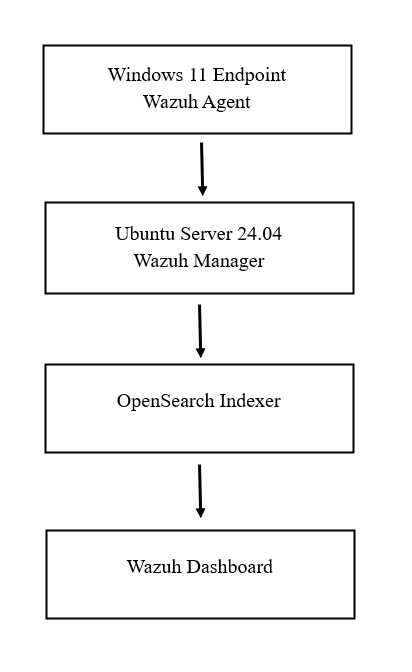
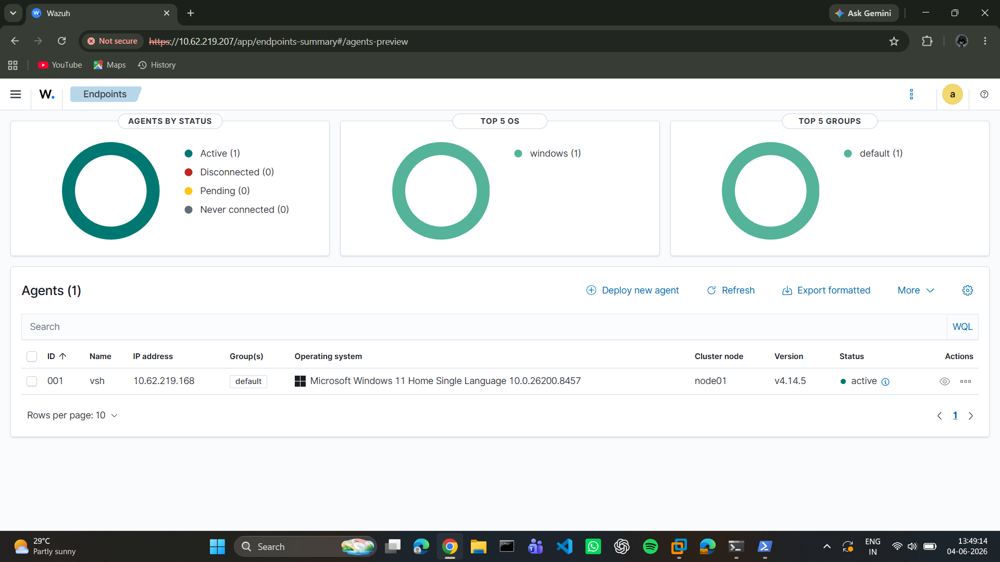
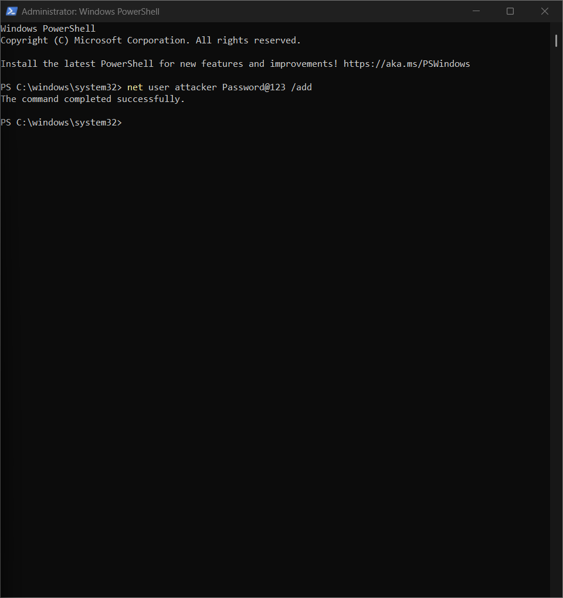
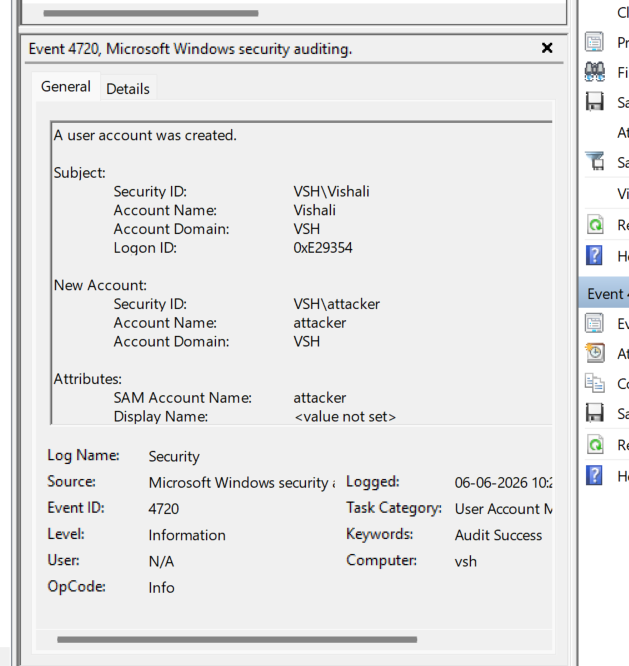
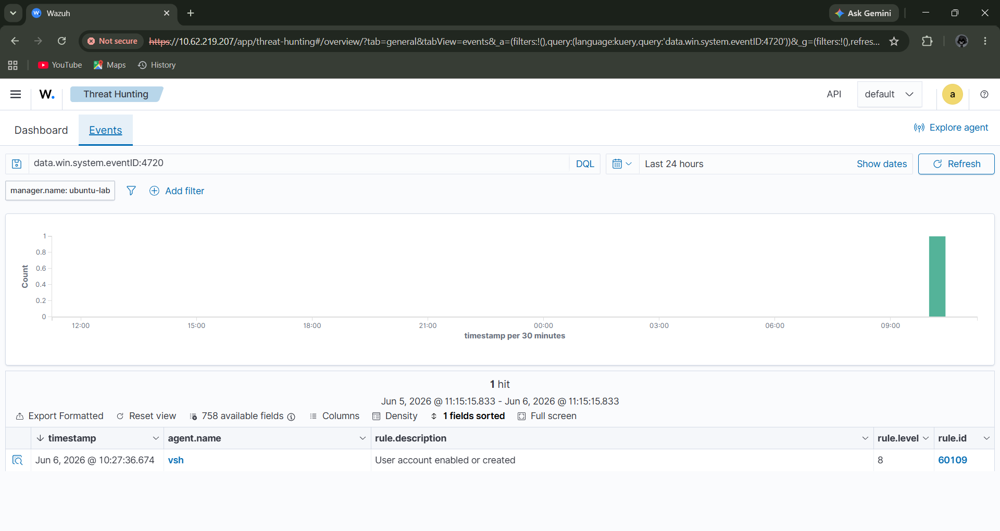
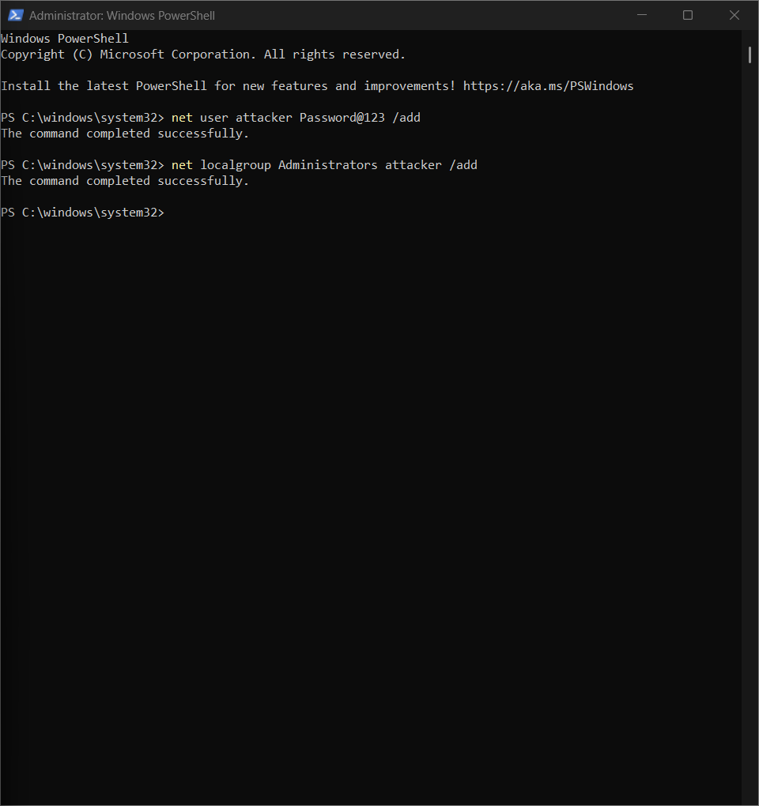
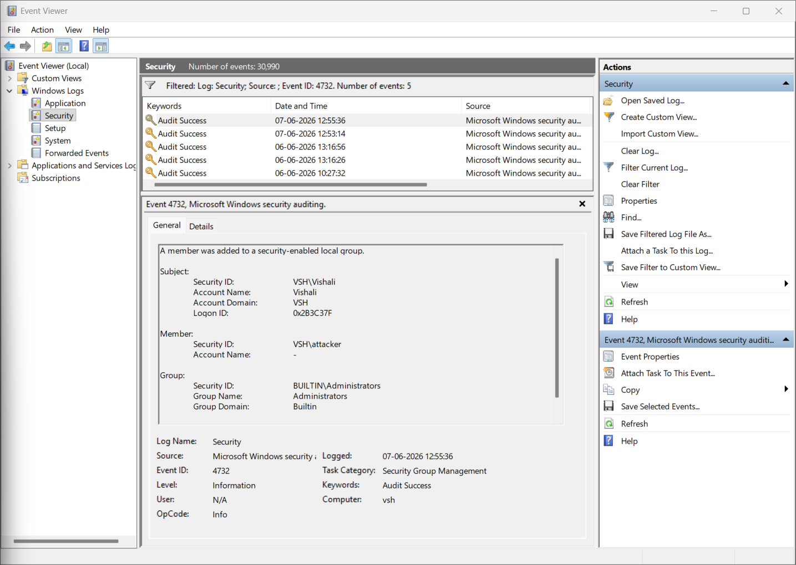
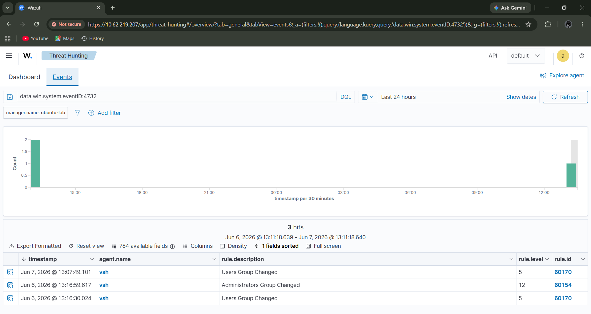
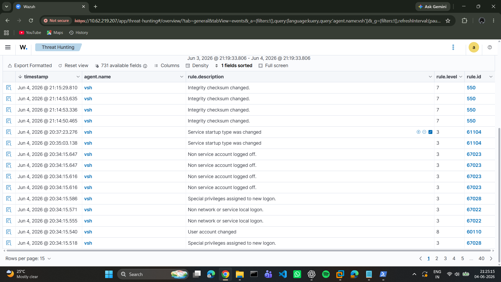

# Wazuh SIEM Home Lab

## Project Overview

This project demonstrates the deployment and configuration of a Security Information and Event Management (SIEM) solution using Wazuh, OpenSearch and Windows endpoints.

The objective of the lab was to build a SOC-style environment capable of monitoring, detecting, and investigating security events generated from Windows endpoints

The lab includes:

- Windows 11 
- Wazuh Manager deployment on Ubuntu
- File Integrity Monitoring(FIM)
- User account monitoring
- Privilege escalation monitoring
- MITRE ATT&CK MAPPING
- Custom detection rule development
- Threat Hunting and Incident Investigation

## Lab Architecture
```text
Windows 11 Endpoint
      |
      ▼
Wazuh Agent
      |
      ▼
Ubuntu Wazuh Manager
      |
      ▼
OpenSearch Indexer
      |
      ▼
Wazuh Dashboard
```

### Architecture Screenshot 


### Active Agents


## Technology Stack
- Wazuh Manager
- Wazuh Agent
- OpenSearch Indexer
- OpenSearch Dashboard
- Ubuntu Server 24.04
- Windows 11
- PowerShell
- VMWare Workstation


## Detection scenarios:-
### 1. User Account Creation Detection
### Objective
Detect unauthorized creation of local user accounts.

### Attack Simulation
```cmd
net user attacker Password@123 /add
```
### Event Generated
Event ID:4720

### MITRE ATT&CK
T1136-Create Account

### Evidence
#### User creation command


#### Event Viewer Event 4720


#### Wazuh Alert


### 2. Administrator Group Membership Detection
### Objective
Detect privilege escalation through administrator group assignment

### Attack Simulation
```cmd
net localgroup Administrators attacker /add
```
### Event Generated 
Event ID: 4732

### MITRE ATT&CK 
T1098 - Account manipulation

### Evidence
#### Administrator Group Command


#### Event Viewer Event 4732


#### Wazuh Alert



### 3. File Integrity Monitoring(FIM)
### Objective
Detect unauthorized file modifications

### Detection Logic
Wazuh Syscheck monitors protected directories and generates alerts when files are:
- created
- modified
- deleted

### Evidence


### 4. PowerShell Threat Detection
### Objective
Monitor PowerShell activity using Script Block Logging.

### Detection Logic
Windows PowerShell Script Block Logging was enabled to generate Event ID 4104 events.

A custom wazuh rule was developed to detect and alert on powershell execution events

### Event Generated
Event ID: 4104

### MITRE ATT&CK
T1059.001 - PowerShell

### Custom Detection Rules

The following custom rule was created to detect PowerShell Script Block Logging events:
```xml
<group name="windows,powershell,">
  <rule id="100100" level="6">
    <if_sid>60000</if_sid>
    <field name="win.system.eventID">^4104$</field>
    <description>
      PowerShell Script Block Logging - Command Executed
    </description>
    <mitre>
      <id>T1059.001</id>
    </mitre>
    <group>powershell,T1059,</group>
  </rule>
</group>
```

## Troubleshooting Performed
During the project, several issues were identified and resolved:

PowerShell Logging Issue-

Problem:
No fresh Event ID 4104 events generated.

Resolution:
Enabled Script Block Logging through registry configuration.

### Agent Connectivity Issue
Problem:
Windows agent disconnected after manager restart.

Resolution:
Opened required UFW ports:
1514/TCP
1515/TCP
443/TCP

### PowerShell Detection Issue
Problem:
Event ID 4104 not generating alerts.

Resolution:
Created custom Wazuh rule and restarted manager.


## Skills Demonstrated
- SIEM Deployment
- Wazuh administration
- Threat Detection Engineering
- Windows Event Analysis
- PowerShell Monitoring
- MITRE ATT&CK Mapping
- Threat Hunting
- Incident Investigation
- Firewall Troubleshooting
- Log Analysis
- Security Monitoring

## Conclusion:
This project successfully implemented a functional SOC-style monitoring environment capable of collecting, analysing, and alerting on security-relevant activity from a Windows endpoint using Wazuh SIEM.
